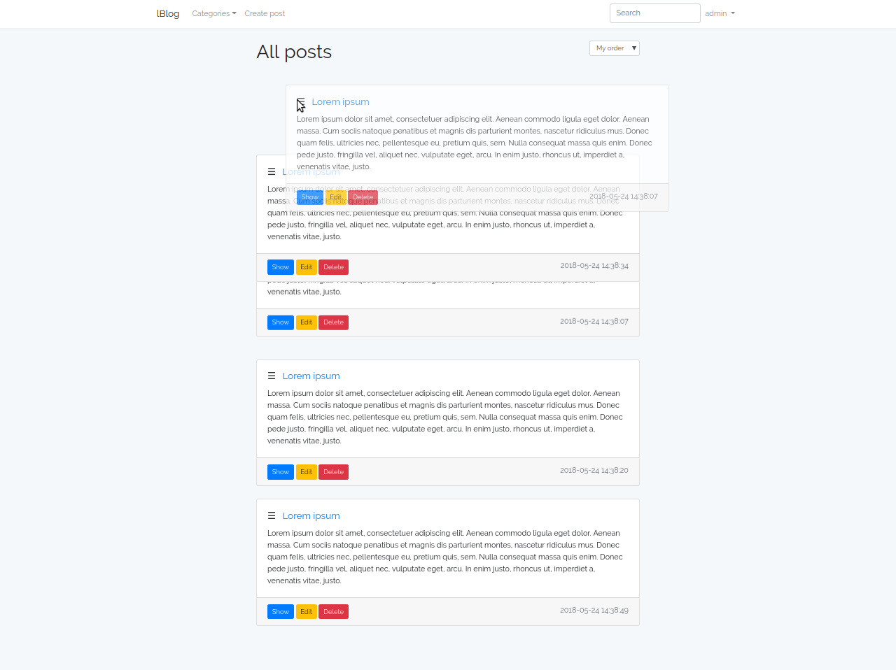

# lBlog - simple Laravel Blog


## About
 - lBlog - simple blog on Laravel 5.6 with the ability to administer
 - use Bootstrap 4.1, jQuery, AJAX
 - list of post, pagination, categories, post search and many other functions...
 - you can sort post by name, by dragging (admin only)
 - CRUD for Post and Category model

## How to run 
1. Create a database named lblog utf8_general_ci
2. Pull project from git provider.
```bash
git clone https://github.com/13338/lblog.git
```
3. Open project folder:
```bash
cd lblog
```
4. Compose dependencies from [Composer](https://getcomposer.org/download/): 
```bash
composer install
```
or
```bash
php composer.phar install
```
5. Copy `.env.example` file to `.env` inside your project root, create app key and fill the database information (`DB_DATABASE`, `DB_USERNAME`, `DB_PASSWORD`...).
```bash
cp .env.example .env
php artisan key:generate
```
6. Run database migration:
```bash
php artisan migrate
```
7. Run server:
```bash
php artisan serve --port=8000
```
##### You can now access your project at localhost:8000. Enjoy! :)